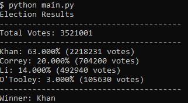

# Python-Challenge

## Introduction
___
    
Python is one of the most common languages used by programmers and engineers across a variety of fields. The popularity in usage is due to the logical syntax that allows ease of code readability, also helped alone by the implemented usage of significant indentation. It is also looked favorably upon by most due to its comprehensive library and list of modules.

___
## Glossary
___
>Links leading to location of each file/folder

| Assignment | Resources | Scripts | Outputs |
|:----------:|:---------:|:-------:|:-------:|
|[PyBank](/Py-Bank)|[Budget Data](/Py-Bank/Resources/budget_data.csv)|[Bank.py](/Py-Bank/main.py)|[Financial Analysis](/Py-Bank/Analysis/Financial_Analysis.txt)|
|[PyPoll](/Py-Poll)|[Election Data](/Py-Poll/Resources/election_data.csv)|[Poll.py](/Py-Poll/main.py)|[Election Results](/Py-Poll/Analysis/Election_Results.txt)|
|[PyBoss](/Py-Boss)|[Employee Data](/Py-Boss/Resources/employee_data.csv)|[Boss.py](/Py-Boss/main.py)|[New Employee Record](/Py-Boss/Analysis/cleaned_employee_data.csv)|

## Objective
___

The objective of this challenge/assignment was to have the students use python in real-world examples to give them an idea of how to utilize python in situations outside of just class and assignments. A resource file was assigned to each part of the assignment which was to serve as a resource for the Python scripts to utilize in order to fulfill the objectives.
    
The overreaching goal to achieve with each assignment was to use python to:
* open and then parse/read data inisde files(i.e csv, text) using modules to open said files        
* manipulate the real-world data to extrapolate answers from

* output the resulting extrapolated data into a separate file and/or the terminal
___
## Part 1: Constricting Finances 🐍
___


The real-life situation was that a comapny's financial records needed to be analyzed.

The task was to create a Python script that pulls and analyzes the records of a [bank's monthly budget](/Py-Bank/Resources/budget_data.csv "Budget Data") to calculate each of the following:

* The total number of months included in the dataset

* The net total amount of "Profit/Losses" over the entire period

* Calculate the changes in "Profit/Losses" over the entire period, then find the average of those change

* The greatest increase in profits (date and amount) over the entire period

* The greatest decrease in losses (date and amount) over the entire period
    
After calculations the [Python script](/Py-Bank/main.py "PyBank Script") then had to be able to print the results into a newly created text file (.txt) in the Analysis folrder and also the terminal as shown below:


The script should then create a new Analysis folder and output the results into a [text file](/Py-Bank/Analysis/Financial_Analysis.txt "PyBank Output") in that folder.

___
## Part 2: Electio Pythonidae 🗳️
___


In this part of the challenge, the 'real-life simulation' was that a small, rural town need to modernize its vote counting process.

After being given the [voting poll data](/Py-Poll/Resources/election_data.csv "Election Data"), the task was to create a Python script that analyzes the votes and calculates each of the following:

* The total number of votes cast

* A complete list of candidates who received votes

* The percentage of votes each candidate won

* The total number of votes each candidate won

* The winner of the election based on popular vote.

The [Python Script](/Py-Poll/main.py "PyPoll Script") should then be able to export out the caluclations into a new [text file](/Py-Poll/Analysis/Election_Results.txt "PyPoll Ouput") as well as the terminal which would look a litte like:



#### Summary:
___
The assignment seemed to have multiple ways to successfully all tasks. The first possible methond would be to use lists as my script did in order to add all the `Cadidates`, their total `Votes`, and their `Votes in Percentages` into 3 separate lists with the position of each candidate's data correspoding in all lists (i.e the 1st Candidate in the `[Candidates]` list also had their votes as 1st in the `[Votes]` and `[Votes_Percentage]` lists). The second method was to use dictionaries's rather than lists with the candidates' names being the `*Keys*` and their # of Votes the `*Values*`. There would need to be 2 dictionaries for the 2 different values being calculated in this scenario: the number of votes a candidate received, and the percentage of total votes a candidates received. Both dictionaries would use the candidnate names as the Keys.

I also chose to write my script in a more open-ended manner. It was possible to write the script such that it would only work with up to 4 candidates in an election; or at the very least, only show the data for the first 4 candidates found by the script. I decided if I wanted to future-proof the script and have it be useable for more future elections the town may have, I needed to have the script work for an arbitray number of cadidates rther than 4. This was done through a series of while loops which would run my print to terminal and write to textfile for as many candidates as found by the python script. All that would need changing would be for the file path if the townspeople wanted to analyze a different voting poll data file. 

🔻Below is an example of how while loops were utilized to keep running for as many cadidates as needed.🔻

```python
i = 0
lines = []
while i < len(candidates):
    line= f"{candidates[i]}: {percent_of_votes[i]:.3f}% ({num_of_votes[i]} votes)"
    lines.append(line)
    i += 1
finalline = f"Winner: {winner}"
lines.append(finalline)
#to print to termial:
i=0
while i < len(lines) - 1:
    print(lines[i])
    i += 1
if i == len(lines) - 1:
    print(linebreak)
    print(lines[i])
#to write to file:
i=0
while i < len(lines) - 1:
    output_file.write(lines[i] + "\n")
    i += 1
if i == len(lines)-1:
    output_file.write(linebreak + "\n")
    output_file.write(lines[i] + "\n")
output_file.close()
```
___
## Bonus: Dominus Pythonidae: 😎
___


In this bonus scenarios, the challenge is to act as the **Boss** of a company that has recently purchased and switched to a new HR system; however, this new system has different requirement in formatting of the employee records data.

The task as the **Boss** is to write a Python script that is able to convert the [old employee data](/Py-Boss/Resources/employee_data.csv "Old Employee Format") into the required formal. The script must be able to:

* The `Name` column should be split into separate `First Name` and `Last Name` columns.

* The `DOB` data should be re-written into `MM/DD/YYYY` format.

* The `SSN` data should be re-written such that the first five numbers are hidden from view.

* The `State` data should be re-written as simple two-letter abbreviations.

To achieve the final results, the split function was heavily used. It easily allowed to separate a whole `Name` into the `First Name` and `Last Name` as well as separate the `DOB` from `YYYY-MM-DD` into `MM`, `DD`, and `Year`, which was then easily sorted back into `MM/DD/YYYY`.
In order to abbreviate the states, a [public state dictionary](https://gist.github.com/rogerallen/1583593 "State Abbreviation Dictionary") was used which contained the
full spelling as the **Key** and the abbreviation as the **Value**.

The old employee was formatted as:


The [Python script](/Py-Boss/main.py "PyBoss Script") was able to instead change and clean up the formatting and make a new `csf` [file](/Py-Boss/Analysis/cleaned_employee_data.csv "New Employee Format") containing the cleaned data. 
The new format now looks like:


___
## Sources/References
___

* [Stackoverflow](https://stackoverflow.com/questions/tagged/python "StackOverflow")

* [GeeksforGeeks](https://www.geeksforgeeks.org/ "GeeksForGeeks")

* [Kite](https://www.kite.com/ "Kite")

* [W3Schools](https://www.w3schools.com/python/default.asp "W3Schools")

* [Tutorialspoint](https://www.tutorialspoint.com/python/ "Python Tutorialspoint")

* [RealPython](https://realpython.com/ "RealPython")

* [YouTube](https://www.youtube.com/watch?v=0C2405R-uGk&t=1s "YouTube - How to Write to Text File")

* [Python Dictionary for State Abbreviations](https://gist.github.com/rogerallen/1583593 "State Abbreviation Dictionary")

* [Wikipedia](https://en.wikipedia.org/wiki/Python_(programming_language) "Wikipedia - Python")

* [Image Source](https://Pexels.com "Pexels")